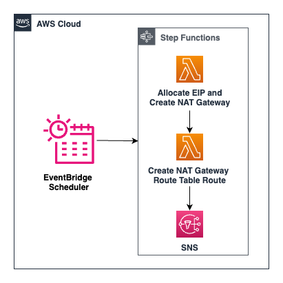
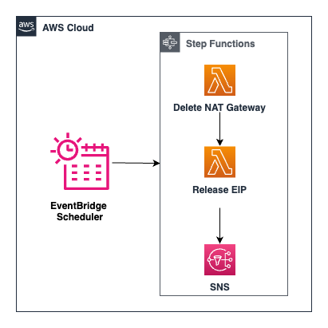
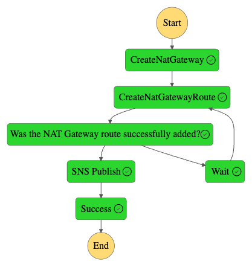
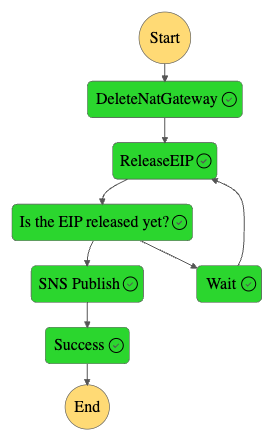

# Automate the Creation and Deletion of NAT Gateways on a Schedule

As a best practice, AWS customers should deploy resources that don’t require direct internet access, such as EC2 instances, databases, queues, caching, or other infrastructure, into a VPC private subnet. Those workloads can take advantage of VPC endpoints to call AWS services privately without having to traverse the public internet. Some workloads require occasional updates from external sources. You can use a NAT gateway so that instances in a private subnet can connect to services outside your VPC but external services cannot initiate a connection with those instances. Since these updates often occur during a scheduled maintenance window, NAT Gateways aren't necessarily required to be in place all the time and can be created and deleted only when needed via a just-in-time (JIT) networking workflow.

This project contains source code and supporting files for a serverless application that allocates an Elastic IP address, creates a NAT Gateway, and adds a route to the NAT Gateway in a VPC route table. The application also deletes the NAT Gateway and releases the Elastic IP address. The process to create and delete a NAT Gateway is orchestrated by an AWS Step Functions State Machine, triggered by an EventBridge Scheduler. The schedule can be defined by parameters during the SAM deployment process.  

The application uses several AWS resources, including an EventBridge Scheduler, Lambda functions, a Step Function State Machine, and an SNS topic. These resources are defined in a template.yaml file. You can update the template to add AWS resources through the same deployment process that updates your application code. This ReadMe.md includes deployment instructions. Note: In order to delete your NAT Gateway, it will need to be in an available state.




This project includes the following files and folders.

- * **docs** - Directory containing supporting documents
- * **src/create-ngw** - Directory containing a Lambda function that allocates an Elastic IP and creates a NAT Gateway
- * **src/create-ngw-route** - Directory containing a Lambda function that creates a route to the NAT Gateway in a VPC route table
- * **src/delete-ngw** - Directory containing a Lambda function that deletes a NAT Gateway
- * **src/ngw-state-machine** - Directory containing Amazon State Language files for an AWS Step Functions State Machine
- * **src/release-eip** - Directory containing a Lambda function that releases an Elastic IP 


## AWS Step Functions State Machines created by this solution



## Deployment Instructions

The Serverless Application Model Command Line Interface (SAM CLI) is an extension of the AWS CLI that adds functionality for building and testing Lambda applications. It uses Docker to run your functions in an Amazon Linux environment that matches Lambda. It can also emulate your application's build environment and API.

To use the SAM CLI, you need the following tools.

* SAM CLI - [Install the SAM CLI](https://docs.aws.amazon.com/serverless-application-model/latest/developerguide/serverless-sam-cli-install.html)
* Node.js - [Install Node.js 10](https://nodejs.org/en/), including the NPM package management tool.
* Docker - [Install Docker community edition](https://hub.docker.com/search/?type=edition&offering=community)

To build and deploy your application for the first time, run the following in your shell:

```bash
sam build
sam deploy --guided --capabilities CAPABILITY_NAMED_IAM
```

The first command will build the source of your application. The second command will package and deploy your application to AWS, with a series of prompts:

* **Stack Name**: The name of the stack to deploy to CloudFormation. This should be unique to your account and region, and a good starting point would be something matching your project name (ex. create-and-delete-ngw).
* **AWS Region**: The region to deploy your resources.
* **SNSTopic [email@email.com]**: An email address for your Amazon SNS Topic subscription.  Amazon SNS will send an email notification upon successful NAT Gateway creation and deletion.
* **RouteTableId [rtb-XXXXXXXXXXXXXXXXX]**: A route table ID for an existing route table in your Amazon VPC.  Ensure that your route table does not have any current entries for a 0.0.0.0/0 destination.
* **Parameter SubnetId [subnet-XXXXXXXXXXXXXXXXX]**: An existing public subnet ID to deploy your NAT Gateway into.
* **ScheduleDay [SAT]**: The day of the week to create and delete your NAT Gateway.  Possible values include SUN, MON, TUE, WED, THU, FRI, SAT.
* **StartTime [12]**: The hour of the day in UTC to trigger the creation of your NAT Gateway. Possible values include numbers from 0-23.
* **DeleteTime [12]**: The hour of the day in UTC to trigger the deletion of your NAT Gateway. Possible values include numbers from 0-23.
* **Confirm changes before deploy**: If set to yes, any change sets will be shown to you before execution for manual review. If set to no, the AWS SAM CLI will automatically deploy application changes.
* **Allow SAM CLI IAM role creation**: Many AWS SAM templates, including this example, create AWS IAM roles required for the AWS Lambda function(s) included to access AWS services. By default, these are scoped down to minimum required permissions. To deploy an AWS CloudFormation stack which creates or modified IAM roles, the `CAPABILITY_IAM` value for `capabilities` must be provided. If permission isn't provided through this prompt, to deploy this example you must explicitly pass `--capabilities CAPABILITY_IAM` to the `sam deploy` command.
* **Disable rollback**: By default, if there's an error during a deployment, your AWS CloudFormation stack rolls back to the last stable state. If you specify --disable-rollback and an error occurs during a deployment, then resources that were created or updated before the error occurred aren't rolled back.
* **Save arguments to samconfig.toml**: If set to yes, your choices will be saved to a configuration file inside the project, so that in the future you can just re-run `sam deploy` without parameters to deploy changes to your application.

## Use the SAM CLI to build and test locally

Build your application with the `sam build` command.

```bash
CreateAndDeleteNGW$ sam build
```

The SAM CLI installs dependencies defined in `package.json`, creates a deployment package, and saves it in the `.aws-sam/build` folder.

Run functions locally and invoke them with the `sam local invoke` command.

## Add a resource to your application
The application template uses AWS Serverless Application Model (AWS SAM) to define application resources. AWS SAM is an extension of AWS CloudFormation with a simpler syntax for configuring common serverless application resources such as functions, triggers, and APIs. For resources not included in [the SAM specification](https://github.com/awslabs/serverless-application-model/blob/master/versions/2016-10-31.md), you can use standard [AWS CloudFormation](https://docs.aws.amazon.com/AWSCloudFormation/latest/UserGuide/aws-template-resource-type-ref.html) resource types.

## Fetch, tail, and filter Lambda function logs

To simplify troubleshooting, SAM CLI has a command called `sam logs`. `sam logs` lets you fetch logs generated by your deployed Lambda function from the command line. In addition to printing the logs on the terminal, this command has several nifty features to help you quickly find the bug.

`NOTE`: This command works for all AWS Lambda functions; not just the ones you deploy using SAM.

```bash
CreateAndDeleteNGW$ sam logs -n create-ngw --stack-name create-and-delete-ngw --tail
```

You can find more information and examples about filtering Lambda function logs in the [SAM CLI Documentation](https://docs.aws.amazon.com/serverless-application-model/latest/developerguide/serverless-sam-cli-logging.html).

## Cleanup

To delete the sample application that you created, use the AWS CLI. Assuming you used your project name for the stack name, you can run the following:

```bash
aws cloudformation delete-stack --stack-name create-and-delete-ngw
```

## Resources

See the [AWS SAM developer guide](https://docs.aws.amazon.com/serverless-application-model/latest/developerguide/what-is-sam.html) for an introduction to SAM specification, the SAM CLI, and serverless application concepts.

Next, you can use AWS Serverless Application Repository to deploy ready to use Apps that go beyond hello world samples and learn how authors developed their applications: [AWS Serverless Application Repository main page](https://aws.amazon.com/serverless/serverlessrepo/)


If you prefer to use an integrated development environment (IDE) to build and test your application, you can use the AWS Toolkit.  
The AWS Toolkit is an open source plug-in for popular IDEs that uses the SAM CLI to build and deploy serverless applications on AWS. The AWS Toolkit also adds a simplified step-through debugging experience for Lambda function code. See the following links to get started.

* [PyCharm](https://docs.aws.amazon.com/toolkit-for-jetbrains/latest/userguide/welcome.html)
* [IntelliJ](https://docs.aws.amazon.com/toolkit-for-jetbrains/latest/userguide/welcome.html)
* [VS Code](https://docs.aws.amazon.com/toolkit-for-vscode/latest/userguide/welcome.html)
* [Visual Studio](https://docs.aws.amazon.com/toolkit-for-visual-studio/latest/user-guide/welcome.html)

## Security

See [CONTRIBUTING](CONTRIBUTING.md#security-issue-notifications) for more information.

## License

This library is licensed under the MIT-0 License. See the LICENSE file.